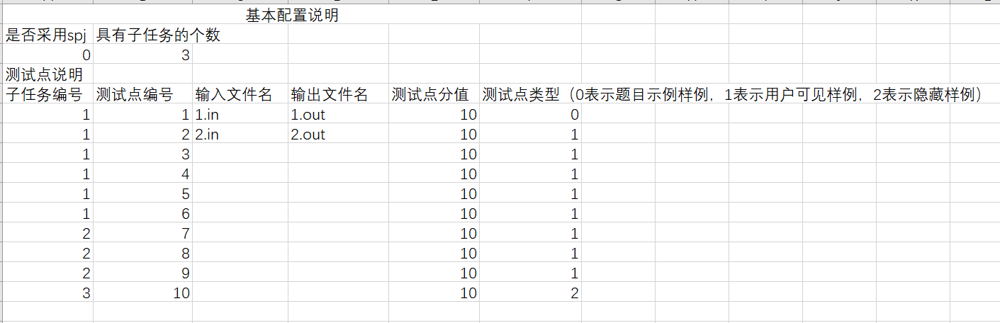

# 题目
## 题目文本上传规范
需要前端贴图，告诉用户在哪里提交题目？略
### 用文件创建题目文本
题目文本的内容需要符合以下规范。
在名为 "question" 的根目录下有 "summary.txt" "题目背景.md" "题目描述.md" "输入格式.md" "输出格式.md" "数据范围与提示.md" 六个文件
文件目录如下：
```
|-- question
    |-- summary.txt
    |-- 题目背景.md
    |-- 题目描述.md
    |-- 输入格式.md
    |-- 输出格式.md
    |-- 数据范围与提示.md
```

目录中的文件为必需文件，不可缺失。请勿修改所示文件名，否则将导致题目上传错误。
其中，如果没有题目背景，则"题目背景.md"的内容可为空。其余文件内容不可为空。

"题目背景.md" "题目描述.md" "输入格式.md" "输出格式.md" "数据范围与提示.md" 的内容均为Markdown文本，将会展示在题目信息中。

"summary.txt"是记录题目基础信息的txt文本，共有六行。
第一行填写题目名称。
第二行填写题目英文名称。
第三行填写题目类型，是一个非负整数：0 （代表传统型），1（代表...）。
第四行填写时间限制，是一个正整数，单位：毫秒。
第五行填写空间限制，是一个正整数，单位：MB。
第六行填写题目来源。

"summary.txt"的一个例子：
```
你好，世界
helloworld
0
1000
512
xx赛
```
"summary.txt"的每一行的内容不可缺失，行与行之间不可调换顺序，否则会导致题目上传错误。

用户需将文件夹 question 压缩成 question.zip 上传。

## 题目数据上传规范
文件目录如下：
```
|-- data
    |-- config.excel
    |-- 测试数据输入文件1
    |-- 测试数据输出文件1
    |-- 测试数据输入文件2
    |-- 测试数据输出文件2
    ...
    |-- 测试数据输入文件k
    |-- 测试数据输出文件k
    ...
```

